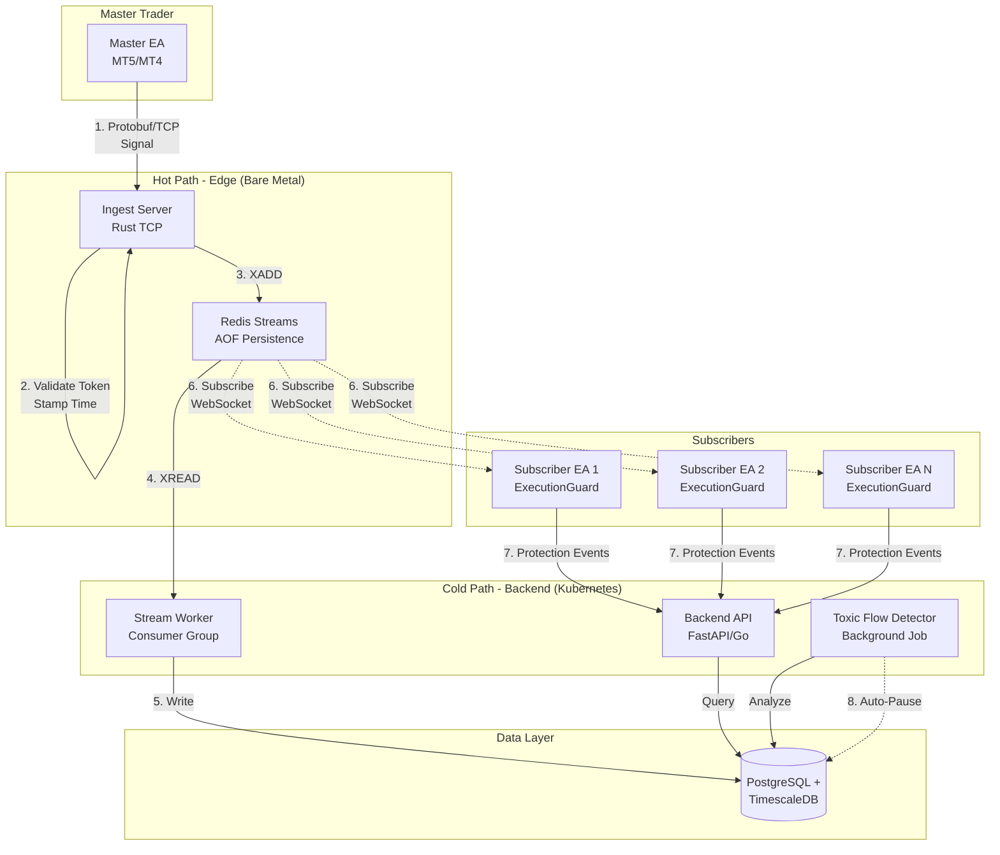
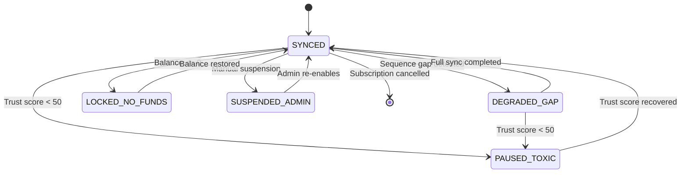
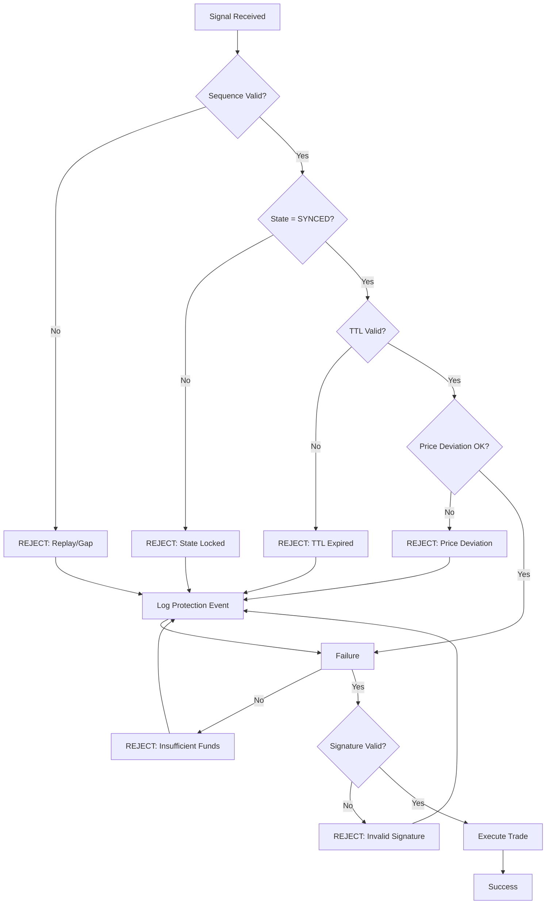

# Distributed Execution Control Plane - System Architecture

## Overview

This document provides a comprehensive architectural overview of the **Distributed Execution Control Plane**, a high-frequency Forex trade replication system designed for adversarial environments.

---

## Core Design Principles

1. **Fail-Closed:** Reject trades on any validation failure (sequence, TTL, price deviation)
2. **Adversarial Defense:** Assume hostile network and potentially malicious receiver EAs
3. **Operator-Grade Visibility:** All rejections logged as "Protection Events" for transparency
4. **Financial Integrity:** Append-only ledger, High-Water Mark (HWM) billing
5. **Low Latency:** <20ms target for hot path (signal ingestion)

---

## System Components



---

## Data Flow

### Signal Lifecycle

1. **Generation (Master EA)**
   - Master trader executes trade on MT5
   - EA captures: symbol, order_type, volume, price, SL/TP
   - Assigns monotonic sequence number
   - Generates HMAC-SHA256 signature
   - Serializes to Protobuf

2. **Ingestion (Hot Path)**
   - TCP connection to Ingest Server
   - License token validation (hash lookup in PostgreSQL)
   - Server timestamp stamped (`Server_Arrival_Time`)
   - Pushed to Redis Stream (`XADD signals:ingest`)
   - Response sent to Master EA (<20ms total)

3. **Persistence (Cold Path)**
   - Stream Worker consumes from Redis (`XREAD`)
   - Writes to `signal_archive` table (TimescaleDB hypertable)
   - Updates subscription metadata (last_sequence_id)
   - Asynchronous, eventual consistency

4. **Distribution (Receiver EAs)**
   - Subscriber EAs connect via WebSocket/HTTP polling
   - Receive signals in real-time
   - Execute through `ExecutionGuard` gatekeeper

5. **Execution (Receiver EA)**
   - **Sequence Guard:** Check for replay/gaps
   - **TTL Shield:** Reject if age > 500ms
   - **Price Deviation Guard:** Reject if slippage > threshold
   - **Fund Check:** Verify wallet balance
   - **Execute:** `OrderSend()` if all guards pass
   - **Log:** Protection events sent to backend

6. **Monitoring (Toxic Flow Detector)**
   - Background worker analyzes `protection_logs`
   - Calculates Trust Score (0-100)
   - Auto-pauses users with score < 50
   - Triggers alerts for degraded users

---

## Database Schema

### Key Tables

#### `subscriptions`
- **Purpose:** Master-Subscriber relationships
- **Key Fields:**
  - `last_sequence_id`: Last processed sequence (monotonic)
  - `high_water_mark`: Maximum profit achieved (for HWM billing)
  - `state`: SYNCED, DEGRADED_GAP, LOCKED_NO_FUNDS, PAUSED_TOXIC

#### `protection_logs` (TimescaleDB Hypertable)
- **Purpose:** High-volume rejection tracking
- **Partitioning:** By `event_time` (1-day chunks)
- **Retention:** 90 days
- **Key Fields:**
  - `reason`: TTL_EXPIRED, SEQUENCE_GAP, PRICE_DEVIATION, etc.
  - `latency_ms`: Signal age when rejected
  - `price_deviation`: Actual slippage in pips

#### `billing_ledger`
- **Purpose:** Append-only financial record
- **Immutability:** NO UPDATES, only INSERTs
- **Key Fields:**
  - `entry_type`: DEPOSIT, WITHDRAWAL, FEE_PERFORMANCE, FEE_SUBSCRIPTION
  - `balance_before`, `balance_after`: Audit trail
  - `hwm_before`, `hwm_after`: High-Water Mark tracking

#### `user_wallets`
- **Purpose:** Pre-paid platform credits
- **Atomicity:** Row-level locks for balance updates
- **Key Fields:**
  - `balance_usd`: Available balance
  - `reserved_usd`: Funds held for pending trades
  - `lifetime_fees`: Total fees paid (for analytics)

---

## State Machine (Subscription States)



### State Descriptions

- **SYNCED:** Normal operation, all sequences in order
- **DEGRADED_GAP:** Missing signals detected, awaiting full sync
- **LOCKED_NO_FUNDS:** Insufficient wallet balance, execution halted
- **PAUSED_TOXIC:** Auto-paused due to low trust score (<50)
- **SUSPENDED_ADMIN:** Manually suspended by operator

---

## Execution Pipeline (Receiver EA)



**Critical Order:** Sequence → State → TTL → Price → Funds → Signature → Execute

---

## High-Water Mark (HWM) Billing

### Concept

Fees are only charged on **new profits** above the previous high-water mark.

### Example

| Event | Profit | HWM Before | HWM After | Fee (20%) |
|-------|--------|------------|-----------|-----------|
| Initial | $0 | $0 | $0 | $0 |
| Trade 1 | +$1,000 | $0 | $1,000 | $200 |
| Trade 2 | -$500 | $1,000 | $1,000 | $0 |
| Trade 3 | +$1,500 | $1,000 | $1,500 | $100 |

**Explanation:**
- Trade 1: Profit $1,000 above HWM ($0) → Fee = $1,000 × 20% = $200
- Trade 2: Loss, HWM unchanged → No fee
- Trade 3: Profit $1,500, but only $500 above HWM ($1,000) → Fee = $500 × 20% = $100

### Implementation

```sql
-- Calculate performance fee
SELECT * FROM calculate_performance_fee(
    '<subscription_id>',
    1500.00,  -- new_profit
    20.00     -- fee_percentage
);

-- Returns:
-- fee_amount: 100.00
-- new_hwm: 1500.00
-- profit_above_hwm: 500.00
```

---

## Trust Score Algorithm

### Scoring Rules

| Event Type | Score Impact | Severity |
|------------|--------------|----------|
| Successful Execution | +1 | Low |
| TTL Expired | -5 | Medium |
| Price Deviation | -3 | Low |
| Sequence Gap | -20 | High |
| Replay Attack | -50 | Critical |
| Invalid Signature | -40 | Critical |

### Auto-Pause Trigger

- **Threshold:** Trust Score < 50
- **Action:** Set subscription state to `PAUSED_TOXIC`
- **Recovery:** +10 points per 24 hours without incidents

### Example Calculation

```python
# User has 100 trust score
# Events in last 24 hours:
# - 3 TTL Expired (-5 each) = -15
# - 1 Sequence Gap (-20) = -20
# Total delta: -35

new_score = max(0, min(100, 100 - 35))  # = 65
should_pause = new_score < 50  # = False (still above threshold)
```

---

## Performance Targets

### Latency SLAs

| Component | Target | Critical |
|-----------|--------|----------|
| Ingest Server (p99) | <20ms | >50ms |
| Database Write | <10ms | >50ms |
| API Response | <100ms | >500ms |
| End-to-End (Master → Receiver) | <200ms | >1000ms |

### Throughput

- **Ingest Server:** 10,000+ signals/sec
- **Database Writes:** 5,000+ inserts/sec
- **Concurrent Subscribers:** 10,000+ EAs

### Availability

- **Uptime SLA:** 99.9% (43 minutes downtime/month)
- **RTO (Recovery Time Objective):** <15 minutes
- **RPO (Recovery Point Objective):** <1 minute (Redis AOF)

---

## Technology Stack

### Hot Path
- **Language:** Rust (for zero-cost abstractions, memory safety)
- **Protocol:** Raw TCP with Protobuf (no HTTP overhead)
- **Message Broker:** Redis Streams (persistence enabled)
- **Deployment:** Bare metal (no Docker/VM overhead)

### Cold Path
- **Backend:** Python (FastAPI) or Go (Gin)
- **Database:** PostgreSQL 14+ with TimescaleDB 2.x
- **Orchestration:** Kubernetes
- **Monitoring:** Prometheus + Grafana

### Receiver EA
- **Language:** MQL5 (C++ compatible)
- **State Machine:** Enum-based (SYNCED, DEGRADED_GAP, etc.)
- **Logging:** File-based + API reporting

---

## Scalability Considerations

### Horizontal Scaling

- **Ingest Server:** Deploy multiple instances behind TCP load balancer
- **Backend API:** Kubernetes auto-scaling (HPA)
- **Database:** Read replicas for analytics queries

### Vertical Scaling

- **Ingest Server:** Pin to dedicated CPU cores (taskset)
- **Database:** Increase shared_buffers, work_mem
- **Redis:** Increase maxmemory, use Redis Cluster for sharding

### Data Retention

- **Hot Data:** 90 days (protection_logs, signal_archive)
- **Warm Data:** 1 year (compressed, S3 archival)
- **Cold Data:** 7 years (compliance, Glacier)

---

## Disaster Recovery

### Backup Strategy

- **Database:** Daily full + hourly incremental (pgBackRest)
- **Redis:** AOF persistence + daily RDB snapshots
- **Configuration:** Git version control

### Failover Procedures

1. **Ingest Server Failure:**
   - Load balancer redirects to standby instance
   - RTO: <1 minute

2. **Database Failure:**
   - Promote read replica to primary
   - RTO: <5 minutes

3. **Redis Failure:**
   - Restore from AOF file
   - RTO: <2 minutes

---

## Future Enhancements

### Phase 2 (Q2 2026)
- [ ] Multi-region deployment (US, EU, APAC)
- [ ] GraphQL API for advanced analytics
- [ ] Machine learning for anomaly detection
- [ ] Mobile app for subscribers

### Phase 3 (Q3 2026)
- [ ] Support for MT4 platform
- [ ] Cryptocurrency trading support
- [ ] White-label solution for brokers
- [ ] Advanced risk management (max drawdown limits)

---

**Document Version:** 1.0  
**Last Updated:** 2026-01-19  
**Maintained By:** Architecture Team
